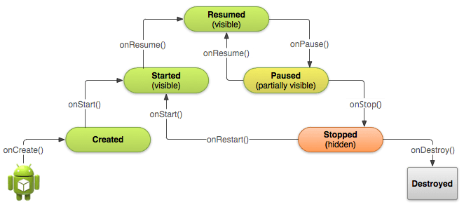
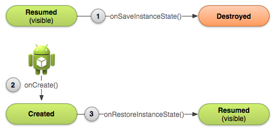

# Android Training 1(release_20170216)

# Android入门基础：从这里开始
### 建立你的第一个App

##### 应用程序的结构：

* src
* res
	* drawable
	* mipmap
	* layout
	* dimen
	* color
	* menu
	* values
	* ......
* build.gradle
* AndroidMainfest.xml


##### android:layout_weight // TODO
arrt|View1|View2|draw
---|---|---|---
weight | 3| 1 | 
width | math_parent | math_parent | 🍉+🍉🍉🍉
width | 0dp | 0dp | 🍉🍉🍉+🍉


##### android:onClick添加点击事件

* Be public
* Have a void return value
* Have a View as the only parameter (this will be the View that was clicked)


### 兼容不同的设备

##### 不同语言
values目录以连字符和ISO国家代码结尾命名。Android会在运行时根据设备的区域设置，加载相应的资源。

```
MyProject/
    res/
       values/
           strings.xml
       values-es/
           strings.xml
       values-fr/
           strings.xml
```

##### 不同屏幕

* 有4种普遍尺寸：小(small)，普通(normal)，大(large)，超大(xlarge)
* 4种普遍分辨率：低精度(ldpi), 中精度(mdpi), 高精度(hdpi), 超高精度(xhdpi)


```
 MyProject/
    res/
        layout/              # default (portrait)
            main.xml
        layout-land/         # landscape
            main.xml
        layout-large/        # large (portrait)
            main.xml
        layout-large-land/   # large landscape
            main.xml
```

##### 不同平台版本
* [Platform Versions](https://developer.android.com/about/dashboards/index.html)每个版本的安卓设备的分布
* 指定最小和目标API级别
* 运行时检查系统版本
* 使用平台风格和主题


### 管理Activity的生命周期



* 使用app的时候，不会因为有来电通话或者切换到其他app而导致程序crash。
* 用户没有激活某个组件时不会消耗宝贵的系统资源。
* 离开app并且一段时间后返回，不会丢失用户的使用进度。
* 设备发生屏幕旋转时不会crash或者丢失用户的使用进度。


##### 指定程序首次启动的Activity

```
<activity android:name=".MainActivity" android:label="@string/app_name">
    <intent-filter>
        <action android:name="android.intent.action.MAIN" />
        <category android:name="android.intent.category.LAUNCHER" />
    </intent-filter>
</activity>
```

##### onPause()

* 停止动画或者是其他正在运行的操作，那些都会导致CPU的浪费.
* 提交在用户离开时期待保存的内容(例如邮件草稿).
* 释放系统资源，例如broadcast receivers, sensors (比如GPS), 或者是其他任何会影响到电量的资源。

如果activity实际上是要被Stop，那么我们应该为了切换的顺畅而减少在OnPause()方法里面的工作量。
不应该使用onPause()来保存用户改变的数据 (例如填入表格中的个人信息) 到永久存储(File或者DB)上。

##### onDestroy()
极端情况下，系统会直接杀死我们的app进程，并不执行activity的onDestroy()回调方法, 因此我们需要使用onStop()来释放资源，从而避免内存泄漏。(这点需要注意)

##### onSaveInstanceState()与onRestoreInstanceState()

onSaveInstanceState()如果被调用，这个方法会在onStop()前被触发，但系统并不保证是否在onPause()之前或者之后触发。



当系统开始停止Activity时，只有在Activity实例会需要重新创建的情况下才会调用到onSaveInstanceState() (1) ，在这个方法里面可以指定额外的状态数据到Bunde中。如果这个Activity被destroyed然后这个实例又需要被重新创建时，系统会传递在 (1) 中的状态数据到 onCreate() (2) 与 onRestoreInstanceState()(3).

 onCreate() 与 onRestoreInstanceState() 回调方法都接收到了同样的Bundle，里面包含了同样的实例状态信息。
onRestoreInstanceState()方法会在 onStart() 方法之后执行. 系统仅仅会在存在需要恢复的状态信息时才会调用 onRestoreInstanceState() ，因此不需要检查 Bundle 是否为null。

### 使用Fragment建立动态的UI
如果APP的最低API版本是11或以上，则不必使用Support Library，我们可以直接使用API框架中的Fragment

FragmentActivity是Support Library提供的一个特殊activity ，用于处理API11版本以下的fragment。如果我们APP中的最低版本大于等于11，则可以使用普通的Activity。

显示Fragment两种方式：

* 当通过XML布局文件的方式将Fragment添加进activity时，Fragment是不能被动态移除的。
* 通过 FragmentManager 创建一个FragmentTransaction对象, FragmentTransaction提供了用来增加、移除、替换以及其它一些操作的APIs。需要一个空的 FrameLayout作为fragment的容器

<h5>addToBackStack()。当移除或者替换一个fragment并把它放入返回栈中时，被移除的fragment的生命周期是stopped(不是destoryed).当用户返回重新恢复这个fragment,它的生命周期是restarts。如果没有把fragment放入返回栈中，那么当它被移除或者替换时，其生命周期是destoryed。</h5>


### 数据保存

##### SharedPreference

* getSharedPreferences() — 如果需要多个通过名称参数来区分的shared preference文件, 名称可以通过第一个参数来指定。可在app中通过任何一个Context 执行该方法。

```
PreferenceManager.getDefaultSharedPreferences(context)
```

* getPreferences() — 当activity仅需要一个shared preference文件时。因为该方法会检索activity下默认的shared preference文件，并不需要提供文件名称。

```
Context context = getActivity();
SharedPreferences sharedPref = context.getSharedPreferences(
        getString(R.string.preference_file_key), Context.MODE_PRIVATE); // MODE_WORLD_READABLE,MODE_WORLD_WRITEABLE 其他任何app均可通过文件名访问该文件
```
R.string.preference_file_key应以与app相关的方式为shared preference文件命名，该名称应唯一。如本例中可将其命名为 "com.example.myapp.PREFERENCE_FILE_KEY" 。


```
SharedPreferences sharedPref = getActivity().getPreferences(Context.MODE_PRIVATE);
SharedPreferences.Editor editor = sharedPref.edit();
editor.putInt(getString(R.string.saved_high_score), newHighScore);
editor.commit();
```

##### 保存到文件

* Internal storage:
	* 总是可用的
	* 这里的文件默认只能被我们的app所访问。
	* 当用户卸载app的时候，系统会把internal内该app相关的文件都清除干净。
	* Internal是我们在想确保不被用户与其他app所访问的最佳存储区域。

* External storage:
	* 并不总是可用的，因为用户有时会通过USB存储模式挂载外部存储器，当取下挂载的这部分后，就无法对其进行访问了。
	* 是大家都可以访问的，因此保存在这里的文件可能被其他程序访问。
	* 当用户卸载我们的app时，系统仅仅会删除external根目录（getExternalFilesDir()）下的相关文件。
	* External是在不需要严格的访问权限并且希望这些文件能够被其他app所共享或者是允许用户通过电脑访问时的最佳存储区域。

权限。如果我们的程序有声明WRITE_EXTERNAL_STORAGE 权限，那么就默认有了读的权限。对于internal storage，我们不需要声明任何权限，因为程序默认就有读写程序目录下的文件的权限。


* 将文件保存在内部存储中
	* context.getFilesDir() 返回表示您的应用的内部目录的 File 。
	* context.getCacheDir() 返回表示您的应用临时缓存文件的内部目录的 File 。请确保这个目录下的文件能够在一旦不再需要的时候马上被删除，并对其大小进行合理限制，例如1MB 。系统的内部存储空间不够时，会自行选择删除缓存文件。

* 将文件保存在外部存储中（需要先查询外部存储状态）
 	
```
/* Checks if external storage is available for read and write */
public boolean isExternalStorageWritable() {
    String state = Environment.getExternalStorageState();
    if (Environment.MEDIA_MOUNTED.equals(state)) {
        return true;
    }
    return false;
}

/* Checks if external storage is available to at least read */
public boolean isExternalStorageReadable() {
    String state = Environment.getExternalStorageState();
    if (Environment.MEDIA_MOUNTED.equals(state) ||
        Environment.MEDIA_MOUNTED_READ_ONLY.equals(state)) {
        return true;
    }
    return false;
}
```

尽管外部存储可被用户和其他应用进行修改，但您可在此处保存两类文件：

* 公共文件（Environment.getExternalStoragePublicDirectory()）
应供其他应用和用户自由使用的文件。 当用户卸载您的应用时，用户应仍可以使用这些文件。例如，您的应用拍摄的照片或其他已下载的文件。

* 私有文件（context.getExternalFilesDir() ）
本属于您的应用且应在用户卸载您的应用时删除的文件。尽管这些文件在技术上可被用户和其他应用访问（因为它们在外部存储上），它们是实际上不向您的应用之外的用户提供值的文件。当用户卸载您的应用时，系统会删除应用外部专用目录中的所有文件。例如，您的应用下载的其他资源或临时介质文件。

如果没有适合您文件的预定义子目录名称，您可以改为调用 getExternalFilesDir() 并传递 null。这将返回外部存储上您的应用的专用目录 的根目录。

<h5>注意：当用户卸载您的应用时，Android 系统会删除以下各项：
您保存在内部存储中的所有文件
您使用 getExternalFilesDir() 保存在外部存储中的所有文件。
但是，您应手动删除使用 getCacheDir() 定期创建的所有缓存文件并且定期删除不再需要的其他文件。</h5>

##### 在 SQL 数据库中保存数据

在SQLiteOpenHelper类做一些与db有关的操作时，系统会对那些有可能比较耗时的操作（例如创建与更新等）在真正需要的时候才去执行，而不是在app刚启动的时候就去做那些动作。因为那些操作可能是很耗时的，请确保在background thread（AsyncTask or IntentService）里面去执行 getWritableDatabase() 或者 getReadableDatabase() 。

数据库创建、版本更新。

增删改查。需要注意防sql注入
db.insert
db.query
db.delete
db.update

### 与其他应用的交互

##### 隐式的Intent
Implicit intents并不声明要启动组件的具体类名，而是声明一个需要执行的action。这个action指定了我们想做的事情，这个action指定了我们想做的事情，数据的具体类型取决于我们想要创建的Intent。


```
Uri number = Uri.parse("tel:5551234");
Intent callIntent = new Intent(Intent.ACTION_DIAL, number);
```

可以使用 putExtra() 方法来添加那些数据。请尽可能的将Intent定义的更加确切。例如，如果想要使用ACTION_VIEW 的intent来显示一张图片，则还应该指定 MIME type 为image/*.这样能够阻止其他能够 "查看" 其他数据类型的app（比如一个地图app) 被这个intent叫起。

##### 验证是否有App去接收这个Intent

**如果触发了一个intent，而且没有任何一个app会去接收这个intent，则app会crash。**

为了验证是否有合适的activity会响应这个intent，需要执行queryIntentActivities() 来获取到能够接收这个intent的所有activity的list。若返回的List非空，那么我们才可以安全的使用这个intent。


```
PackageManager packageManager = getPackageManager();
List<ResolveInfo> activities = packageManager.queryIntentActivities(intent, 0);
boolean isIntentSafe = activities.size() > 0;
```

startActivity(intent)启动Activity

强制弹出选择的对话框，Intent.createChooser(intent)。

##### 接收Result

三个参数：

* 通过startActivityForResult()传递的request code。
* 第二个activity指定的result code。如果操作成功则是RESULT_OK ，如果用户没有操作成功，而是直接点击回退或者其他什么原因，那么则是RESULT_CANCELED
* 包含了所返回result数据的intent。（为正确处理这些result，我们必须了解那些result intent的格式。）

```
@Override
protected void onActivityResult(int requestCode, int resultCode, Intent data) {}
```

##### manifest添加Intent Filter

* Action:一个想要执行的动作的名称。通常是系统已经定义好的值，如ACTION_SEND或ACTION_VIEW。 在intent filter中通过<action>指定它的值，值的类型必须为字符串，而不是API中的常量(看下面的例子)

* Data:Intent附带数据的描述。在intent filter中通过<data>指定它的值，可以使用一个或者多个属性，我们可以只定义MIME type或者是只指定URI prefix，也可以只定义一个URI scheme，或者是他们综合使用。

* Category:提供一个附加的方法来标识这个activity能够handle的intent。通常与用户的手势或者是启动位置有关。系统有支持几种不同的categories,但是大多数都很少用到。而且，所有的implicit intents都默认是 CATEGORY_DEFAULT 类型的。在intent filter中用<category>指定它的值。

```
<activity android:name="ShareActivity">
    <intent-filter>
        <action android:name="android.intent.action.SEND"/>
        <category android:name="android.intent.category.DEFAULT"/>
        <data android:mimeType="text/plain"/>
        <data android:mimeType="image/*"/>
    </intent-filter>
</activity>
```
如果任何的两对action与data是互相矛盾的，就应该创建不同的intent filter来指定特定的action与type。
例如，假设我们的activity可以handle 文本与图片，无论是ACTION_SEND还是ACTION_SENDTO 的intent。
在这种情况下，就必须为两个action定义两个不同的intent filter。因为ACTION_SENDTO intent 必须使用 Uri 类型来指定接收者使用 send 或 sendto 的地址。


```
<activity android:name="ShareActivity">
    <!-- filter for sending text; accepts SENDTO action with sms URI schemes -->
    <intent-filter>
        <action android:name="android.intent.action.SENDTO"/>
        <category android:name="android.intent.category.DEFAULT"/>
        <data android:scheme="sms" />
        <data android:scheme="smsto" />
    </intent-filter>
    <!-- filter for sending text or images; accepts SEND action and text or image data -->
    <intent-filter>
        <action android:name="android.intent.action.SEND"/>
        <category android:name="android.intent.category.DEFAULT"/>
        <data android:mimeType="image/*"/>
        <data android:mimeType="text/plain"/>
    </intent-filter>
</activity>
```

Note:为了接受implicit intents, 必须在我们的intent filter中包含 CATEGORY_DEFAULT 的category。startActivity()和startActivityForResult()方法将所有intent视为声明了CATEGORY_DEFAULT category。如果没有在的intent filter中声明CATEGORY_DEFAULT，activity将无法对implicit intent做出响应。
我们没有必要在意自己的activity是被用startActivity() 还是 startActivityForResult()方法所叫起的。系统会自动去判断该如何传递result。在不需要的result的case下，result会被自动忽略。

### 系统权限功能 // TODO


