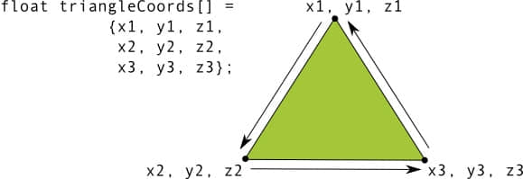

# Android Training 4 图像与动画

## 高效显示Bitmap


```
static int getBytesPerPixel(Config config) {
    if (config == Config.ARGB_8888) {
        return 4;
    } else if (config == Config.RGB_565) {
        return 2;
    } else if (config == Config.ARGB_4444) {
        return 2;
    } else if (config == Config.ALPHA_8) {
        return 1;
    }
    return 1;
}
```

* 移动设备的系统资源有限。
* Bitmap会消耗很多内存，特别是对于类似照片等内容更加丰富的图片。 例如，Galaxy Nexus的照相机能够拍摄2592x1936 pixels (5 MB)的图片。 如果bitmap的图像配置是使用ARGB_8888 (从Android 2.3开始的默认配置) ，那么加载这张照片到内存大约需要19MB(2592*1936*4 bytes) 的空间，从而迅速消耗掉该应用的剩余内存空间。
* Android应用的UI通常会在一次操作中立即加载许多张bitmaps。 而且需要预先加载一些没有在屏幕上显示的内容，为用户滑动的显示做准备。

### 加载大图

考虑到应用是在有限的内存下工作的，理想情况是我们只需要在内存中加载一个低分辨率的照片即可。为了更便于显示，这个低分辨率的照片应该是与其对应的UI控件大小相匹配的。

快速滑动图片时容易产生额外的效率。

#### 读取位图的尺寸与类型

BitmapFactory提供了一些解码（decode）的方法（decodeByteArray(), decodeFile(), decodeResource()等），用来从不同的资源中创建一个Bitmap。 我们应该根据图片的数据源来选择合适的解码方法。 这些方法在构造位图的时候会尝试分配内存，因此会容易导致OutOfMemory的异常。每一种解码方法都可以通过BitmapFactory.Options设置一些附加的标记，以此来指定解码选项。设置 inJustDecodeBounds 属性为true可以在解码的时候避免内存的分配，它会返回一个null的Bitmap，但是可以获取到 outWidth, outHeight 与 outMimeType。该技术可以允许你在构造Bitmap之前优先读图片的尺寸与类型。

```
BitmapFactory.Options options = new BitmapFactory.Options();
options.inJustDecodeBounds = true;
BitmapFactory.decodeResource(getResources(), R.id.myimage, options);
int imageHeight = options.outHeight;
int imageWidth = options.outWidth;
String imageType = options.outMimeType;
```
为了避免java.lang.OutOfMemory 的异常，我们需要在真正解析图片之前检查它的尺寸（除非你能确定这个数据源提供了准确无误的图片且不会导致占用过多的内存）。

#### 加载一个按比例缩小的版本到内存中

因素需要考虑：

* 评估加载完整图片所需要耗费的内存。
* 程序在加载这张图片时可能涉及到的其他内存需求。
* 呈现这张图片的控件的尺寸大小。
* 屏幕大小与当前设备的屏幕密度。

例如, 一个分辨率为2048x1536的图片，如果设置 inSampleSize 为4，那么会产出一个大约512x384大小的Bitmap。加载这张缩小的图片仅仅使用大概0.75MB的内存，如果是加载完整尺寸的图片，那么大概需要花费12MB（前提都是Bitmap的配置是 ARGB_8888）。


```
public static int calculateInSampleSize(
            BitmapFactory.Options options, int reqWidth, int reqHeight) {
    // Raw height and width of image
    final int height = options.outHeight;
    final int width = options.outWidth;
    int inSampleSize = 1;

    if (height > reqHeight || width > reqWidth) {

        final int halfHeight = height / 2;
        final int halfWidth = width / 2;

        // Calculate the largest inSampleSize value that is a power of 2 and keeps both
        // height and width larger than the requested height and width.
        while ((halfHeight / inSampleSize) > reqHeight
                && (halfWidth / inSampleSize) > reqWidth) {
            inSampleSize *= 2;
        }
    }

    return inSampleSize;
}
```

注意：设置inSampleSize为2的幂是因为解码器最终还是会对非2的幂的数进行向下处理，获取到最靠近2的幂的数。

为了使用该方法，首先需要设置 inJustDecodeBounds 为 true, 把options的值传递过来，然后设置 inSampleSize 的值并设置 inJustDecodeBounds 为 false，之后重新调用相关的解码方法。

```
public static Bitmap decodeSampledBitmapFromResource(Resources res, int resId,
        int reqWidth, int reqHeight) {

    // First decode with inJustDecodeBounds=true to check dimensions
    final BitmapFactory.Options options = new BitmapFactory.Options();
    options.inJustDecodeBounds = true;
    BitmapFactory.decodeResource(res, resId, options);

    // Calculate inSampleSize
    options.inSampleSize = calculateInSampleSize(options, reqWidth, reqHeight);

    // Decode bitmap with inSampleSize set
    options.inJustDecodeBounds = false;
    return BitmapFactory.decodeResource(res, resId, options);
}
```

如下面的代码样例显示了一个**接近** 100x100像素的缩略图：

```
mImageView.setImageBitmap(
    decodeSampledBitmapFromResource(getResources(), R.id.myimage, 100, 100));
```

### 非UI线程处理Bitmap

#### 使用AsyncTask


```
class BitmapWorkerTask extends AsyncTask {
    private final WeakReference imageViewReference;
    private int data = 0;

    public BitmapWorkerTask(ImageView imageView) {
        // Use a WeakReference to ensure the ImageView can be garbage collected
        imageViewReference = new WeakReference(imageView);
    }

    // Decode image in background.
    @Override
    protected Bitmap doInBackground(Integer... params) {
        data = params[0];
        return decodeSampledBitmapFromResource(getResources(), data, 100, 100));
    }

    // Once complete, see if ImageView is still around and set bitmap.
    @Override
    protected void onPostExecute(Bitmap bitmap) {
        if (imageViewReference != null && bitmap != null) {
            final ImageView imageView = imageViewReference.get();
            if (imageView != null) {
                imageView.setImageBitmap(bitmap);
            }
        }
    }
}
```
为ImageView使用WeakReference确保了AsyncTask所引用的资源可以被垃圾回收器回收。

```
public void loadBitmap(int resId, ImageView imageView) {
    BitmapWorkerTask task = new BitmapWorkerTask(imageView);
    task.execute(resId);
}
```

#### 处理并发问题

[Multithreading for Performance](http://android-developers.blogspot.com/2010/07/multithreading-for-performance.html) 这篇博文更进一步的讨论了如何处理并发问题，并且提供了一种解决方法：ImageView保存最近使用的AsyncTask的引用，这个引用可以在任务完成的时候再次读取检查。使用这种方式, 就可以对前面提到的AsyncTask进行扩展。

```
static class AsyncDrawable extends BitmapDrawable {
    private final WeakReference bitmapWorkerTaskReference;

    public AsyncDrawable(Resources res, Bitmap bitmap,
            BitmapWorkerTask bitmapWorkerTask) {
        super(res, bitmap);
        bitmapWorkerTaskReference =
            new WeakReference(bitmapWorkerTask);
    }

    public BitmapWorkerTask getBitmapWorkerTask() {
        return bitmapWorkerTaskReference.get();
    }
}
```

```
class BitmapWorkerTask extends AsyncTask {
    ...

    @Override
    protected void onPostExecute(Bitmap bitmap) {
        if (isCancelled()) {
            bitmap = null;
        }

        if (imageViewReference != null && bitmap != null) {
            final ImageView imageView = imageViewReference.get();
            final BitmapWorkerTask bitmapWorkerTask =
                    getBitmapWorkerTask(imageView);
            if (this == bitmapWorkerTask && imageView != null) {
                imageView.setImageBitmap(bitmap);
            }
        }
    }
}
```

```
	public void loadBitmap(int resId, ImageView imageView) {
    	if (cancelPotentialWork(resId, imageView)) {
        	final BitmapWorkerTask task = new BitmapWorkerTask(imageView);
        	final AsyncDrawable asyncDrawable =
                new AsyncDrawable(getResources(), mPlaceHolderBitmap, task);
        	imageView.setImageDrawable(asyncDrawable);
        	task.execute(resId);
    	}
    }
    
    public static boolean cancelPotentialWork(int data, ImageView imageView) {
	    final BitmapWorkerTask bitmapWorkerTask = getBitmapWorkerTask(imageView);
	
	    if (bitmapWorkerTask != null) {
	        final int bitmapData = bitmapWorkerTask.data;
	        if (bitmapData == 0 || bitmapData != data) {
	            // Cancel previous task
	            bitmapWorkerTask.cancel(true);
	        } else {
	            // The same work is already in progress
	            return false;
	        }
	    }
	    // No task associated with the ImageView, or an existing task was cancelled
	    return true;
	}


	private static BitmapWorkerTask getBitmapWorkerTask(ImageView imageView) {
	   if (imageView != null) {
	       final Drawable drawable = imageView.getDrawable();
	       if (drawable instanceof AsyncDrawable) {
	           final AsyncDrawable asyncDrawable = (AsyncDrawable) drawable;
	           return asyncDrawable.getBitmapWorkerTask();
	       }
	    }
	    return null;
	}
```

### 缓存Bitmap

#### 内存缓存

内存缓存以花费宝贵的程序内存为前提来快速访问位图。LruCache类（在API Level 4的Support Library中也可以找到）特别适合用来缓存Bitmaps，它使用一个强引用（strong referenced）的LinkedHashMap保存最近引用的对象，并且在缓存超出设置大小的时候剔除（evict）最近最少使用到的对象。

Note: 在过去，一种比较流行的内存缓存实现方法是使用软引用（SoftReference）或弱引用（WeakReference）对Bitmap进行缓存，然而我们并不推荐这样的做法。从Android 2.3 (API Level 9)开始，垃圾回收机制变得更加频繁，这使得释放软（弱）引用的频率也随之增高，导致使用引用的效率降低很多。而且在Android 3.0 (API Level 11)之前，备份的Bitmap会存放在Native Memory中，它不是以可预知的方式被释放的，这样可能导致程序超出它的内存限制而崩溃。

为了给LruCache选择一个合适的大小，需要考虑到下面一些因素：

* 应用剩下了多少可用的内存?
* 多少张图片会同时呈现到屏幕上？有多少图片需要准备好以便马上显示到屏幕？
* 设备的屏幕大小与密度是多少？一个具有特别高密度屏幕（xhdpi）的设备，像Galaxy Nexus会比Nexus S（hdpi）需要一个更大的缓存空间来缓存同样数量的图片。
* Bitmap的尺寸与配置是多少，会花费多少内存？
* 图片被访问的频率如何？是其中一些比另外的访问更加频繁吗？如果是，那么我们可能希望在内存中保存那些最常访问的图片，或者根据访问频率给Bitmap分组，为不同的Bitmap组设置多个LruCache对象。
* 是否可以在缓存图片的质量与数量之间寻找平衡点？某些时候保存大量低质量的Bitmap会非常有用，加载更高质量图片的任务可以交给另外一个后台线程。

缓存太小会导致额外的花销却没有明显的好处，缓存太大同样会导致java.lang.OutOfMemory的异常，并且使得你的程序只留下小部分的内存用来工作（缓存占用太多内存，导致其他操作会因为内存不够而抛出异常）。

为Bitmap建立LruCache的示例：

```
private LruCache<String, Bitmap> mMemoryCache;

@Override
protected void onCreate(Bundle savedInstanceState) {
    ...
    // Get max available VM memory, exceeding this amount will throw an
    // OutOfMemory exception. Stored in kilobytes as LruCache takes an
    // int in its constructor.
    final int maxMemory = (int) (Runtime.getRuntime().maxMemory() / 1024);

    // Use 1/8th of the available memory for this memory cache.
    final int cacheSize = maxMemory / 8;

    mMemoryCache = new LruCache<String, Bitmap>(cacheSize) {
        @Override
        protected int sizeOf(String key, Bitmap bitmap) {
            // The cache size will be measured in kilobytes rather than
            // number of items.
            return bitmap.getByteCount() / 1024;
        }
    };
    ...
}

public void addBitmapToMemoryCache(String key, Bitmap bitmap) {
    if (getBitmapFromMemCache(key) == null) {
        mMemoryCache.put(key, bitmap);
    }
}

public Bitmap getBitmapFromMemCache(String key) {
    return mMemoryCache.get(key);
}
```

> Note:在上面的例子中, 有1/8的内存空间被用作缓存。 这意味着在常见的设备上（hdpi），最少大概有4MB的缓存空间（32/8）。如果一个填满图片的GridView控件放置在800x480像素的手机屏幕上，大概会花费1.5MB的缓存空间（800x480x4 bytes），因此缓存的容量大概可以缓存2.5页的图片内容。

当加载Bitmap显示到ImageView 之前，会先从LruCache 中检查是否存在这个Bitmap。如果确实存在，它会立即被用来显示到ImageView上，如果没有找到，会触发一个后台线程去处理显示该Bitmap任务。

#### 磁盘缓存
我们的应用可能会被类似打电话等行为而暂停并退到后台，因为后台应用可能会被杀死，那么内存缓存就会被销毁，里面的Bitmap也就不存在了。一旦用户恢复应用的状态，那么应用就需要重新处理那些图片。

磁盘缓存可以用来保存那些已经处理过的Bitmap，它还可以减少那些不再内存缓存中的Bitmap的加载次数。当然从磁盘读取图片会比从内存要慢，而且由于磁盘读取操作时间是不可预期的，读取操作需要在后台线程中处理。

> Note:如果图片会被更频繁的访问，使用ContentProvider或许会更加合适，比如在图库应用中。


> Note:因为初始化磁盘缓存涉及到I/O操作，所以它不应该在主线程中进行。但是这也意味着在初始化完成之前缓存可以被访问。为了解决这个问题，在上面的实现中，有一个锁对象（lock object）来确保在磁盘缓存完成初始化之前，应用无法对它进行读取。

内存缓存的检查是可以在UI线程中进行的，磁盘缓存的检查需要在后台线程中处理。磁盘操作永远都不应该在UI线程中发生。

#### 处理配置改变(使用Fragment来保留LruCache)

如果运行时设备配置信息发生改变，例如屏幕方向的改变会导致Android中当前显示的Activity先被销毁然后重启。

这个缓存可以通过调用Fragment.setRetainInstance(true))保留一个Fragment实例的方法把缓存传递给新的Activity。在这个Activity被重新创建之后，这个保留的Fragment会被重新附着上。

### 管理Bitmap的内存使用

首先要知道Android管理Bitmap内存使用的演变进程:

* 在Android 2.2 (API level 8)以及之前，当垃圾回收发生时，应用的线程是会被暂停的，这会导致一个延迟滞后，并降低系统效率。 从Android 2.3开始，添加了并发垃圾回收的机制， 这意味着在一个Bitmap不再被引用之后，它所占用的内存会被立即回收。
* 在Android 2.3.3 (API level 10)以及之前, 一个Bitmap的像素级数据（pixel data）是存放在Native内存空间中的。 这些数据与Bitmap本身是隔离的，Bitmap本身被存放在Dalvik堆中。我们无法预测在Native内存中的像素级数据何时会被释放，这意味着程序容易超过它的内存限制并且崩溃。 自Android 3.0 (API Level 11)开始， 像素级数据则是与Bitmap本身一起存放在Dalvik堆中。

#### 管理Android 2.3.3及以下版本的内存使用
在Android 2.3.3 (API level 10) 以及更低版本上，推荐使用recycle()方法。
> Caution：只有当我们确定这个Bitmap不再需要用到的时候才应该使用recycle()。在执行recycle()方法之后，如果尝试绘制这个Bitmap， 我们将得到"Canvas: trying to use a recycled bitmap"的错误提示。

#### 管理Android 3.0及其以上版本的内存
从Android 3.0 (API Level 11)开始，引进了BitmapFactory.Options.inBitmap字段。 如果使用了这个设置字段，decode方法会在加载Bitmap数据的时候去重用已经存在的Bitmap。这意味着Bitmap的内存是被重新利用的，这样可以提升性能，并且减少了内存的分配与回收。然而，使用inBitmap有一些限制，特别是在Android 4.4 (API level 19)之前，只有同等大小的位图才可以被重用。

**保存Bitmap供以后使用**

### 在UI上显示Bitmap

#### 实现加载图片到ViewPager

我们可以通过PagerAdapter与ViewPager控件来实现这个效果。 不过，一个更加合适的Adapter是PagerAdapter的一个子类，叫做FragmentStatePagerAdapter：它可以在某个ViewPager中的子视图切换出屏幕时自动销毁与保存Fragments的状态。这样能够保持更少的内存消耗。

> Note: 如果只有为数不多的图片并且确保不会超出程序内存限制，那么使用PagerAdapter或 FragmentPagerAdapter会更加合适。

## 使用OpenGL ES显示图像

### 建立OpenGL ES的环境

GLSurfaceView类和GLSurfaceView.Renderer类。GLSurfaceView是一个View容器，它用来存放使用OpenGL绘制的图形，而GLSurfaceView.Renderer则用来控制在该View中绘制的内容。

对于一个全屏的或者接近全屏的图形View，使用GLSurfaceView。
图形集成在布局的一小部分里面，那么可以考虑使用TextureView。
也可以可以通过使用SurfaceView搭建一个OpenGL ES View，但是比较麻烦。 


#### 构建一个GLSurfaceView对象


```
class MyGLSurfaceView extends GLSurfaceView {

    private final MyGLRenderer mRenderer;

    public MyGLSurfaceView(Context context){
        super(context);

        // Create an OpenGL ES 2.0 context
        setEGLContextClientVersion(2);

        mRenderer = new MyGLRenderer();

        // Set the Renderer for drawing on the GLSurfaceView
        setRenderer(mRenderer);
        setRenderMode(GLSurfaceView.RENDERMODE_WHEN_DIRTY);

    }
}
```

GLSurfaceView.RENDERMODE_WHEN_DIRTY，其含义是：仅在你的绘制数据发生变化时才在视图中进行绘制操作。如果选用这一配置选项，那么除非调用了requestRender()，否则GLSurfaceView不会被重新绘制，这样做可以让应用的性能及效率得到提高。

#### 构建一个渲染类

* onSurfaceCreated()：调用一次，用来配置View的OpenGL ES环境。
* onDrawFrame()：每次重新绘制View时被调用。
* onSurfaceChanged()：如果View的几何形态发生变化时会被调用，例如当设备的屏幕方向发生改变时。

### 定义形状

OpenGL ES允许我们使用三维空间的坐标来定义绘画对象。所以在我们能画三角形之前，必须先定义它的坐标。

在OpenGL 中，典型的办法是为坐标定义一个浮点型的顶点数组。为了高效起见，我们可以将坐标写入一个ByteBuffer.

```
public class Triangle {

    private FloatBuffer vertexBuffer;

    // number of coordinates per vertex in this array
    static final int COORDS_PER_VERTEX = 3;
    static float triangleCoords[] = {   // in counterclockwise order:
             0.0f,  0.622008459f, 0.0f, // top
            -0.5f, -0.311004243f, 0.0f, // bottom left
             0.5f, -0.311004243f, 0.0f  // bottom right
    };

    // Set color with red, green, blue and alpha (opacity) values
    float color[] = { 0.63671875f, 0.76953125f, 0.22265625f, 1.0f };

    public Triangle() {
        // initialize vertex byte buffer for shape coordinates
        ByteBuffer bb = ByteBuffer.allocateDirect(
                // (number of coordinate values * 4 bytes per float)
                triangleCoords.length * 4);
        // use the device hardware's native byte order
        bb.order(ByteOrder.nativeOrder());

        // create a floating point buffer from the ByteBuffer
        vertexBuffer = bb.asFloatBuffer();
        // add the coordinates to the FloatBuffer
        vertexBuffer.put(triangleCoords);
        // set the buffer to read the first coordinate
        vertexBuffer.position(0);
    }
}
```

注意到这个形状的坐标是以逆时针顺序定义的。




## 添加动画

### View间渐变

渐变动画（也叫消失）通常指渐渐的淡出某个UI组件，同时同步地淡入另一个。
渐变简短不易察觉，同时又提供从一个界面到下一个之间流畅的转换。如果在需要转换的时候没有使用任何动画效果，这会使得转换看上去感到生硬而仓促。

对于被淡入的View，设置它的visibility为GONE。这样防止view再占据布局的空间，而且也能在布局计算中将其忽略，加速处理过程。

实现渐变动画吧：

* 对于正在淡入的View，设置它的alpha值为0并且设置visibility为 VISIBLE（记住他起初被设置成了 GONE）。这样View就变成可见的了，但是此时它是透明的。

* 对于正在淡入的View，把alpha值从0动态改变到1。同时，对于淡出的View，把alpha值从1动态变到0。

* 使用Animator.AnimatorListener中的 onAnimationEnd()，设置淡出View的visibility为GONE。即使alpha值为0，也要把View的visibility设置成GONE来防止 view 占据布局空间，还能把它从布局计算中忽略，加速处理过程。

### 使用ViewPager实现屏幕滑动

#### 用PageTransformer自定义动画

[Zoom-out Page Transformer](http://hukai.me/android-training-course-in-chinese/animations/screen-slide.html#Zoom-out Page Transformer)

[Depth Page Transformer](http://hukai.me/android-training-course-in-chinese/animations/screen-slide.html#Depth Page Transformer)


```
	ViewPager.PageTransformer() {
           	@Override
            public void transformPage(View page, float position) {
                Log.i("PageTransformer", "page:" + page.getTag() + " current:" + position);
            }
        }
```

```
I/PageTransformer: page:0 current:0.0
I/PageTransformer: page:1 current:1.0
```

position参数表示特定页面相对于屏幕中的页面的位置。它的值在用户滑动页面过程中动态变化。当某一页面填充屏幕，它的值为0。当页面刚向屏幕右侧方向被拖走，它的值为1。如果用户在页面1和页面2间滑动到一半，那么页面1的position为-0.5并且页面2的position为 0.5。根据屏幕上页面的position，我们可以通过setAlpha()，setTranslationX()或setScaleY()这些方法设定页面属性来自定义滑动动画。

### Fragment动画实现Card翻转动画


```
getFragmentManager()
            .beginTransaction()

            // Replace the default fragment animations with animator resources representing
            // rotations when switching to the back of the card, as well as animator
            // resources representing rotations when flipping back to the front (e.g. when
            // the system Back button is pressed).
            .setCustomAnimations(
                    R.animator.card_flip_right_in, R.animator.card_flip_right_out,
                    R.animator.card_flip_left_in, R.animator.card_flip_left_out)

            // Replace any fragments currently in the container view with a fragment
            // representing the next page (indicated by the just-incremented currentPage
            // variable).
            .replace(R.id.container, new CardBackFragment())

            // Add this transaction to the back stack, allowing users to press Back
            // to get to the front of the card.
            .addToBackStack(null)

            // Commit the transaction.
            .commit();
```
### 缩放View

### 布局变更动画

```
<LinearLayout android:id="@+id/container"
    android:animateLayoutChanges="true"
    ...
/>
```

如果你想补充自定义布局动画，创建 LayoutTransition 对象，然后用 setLayoutTransition() 方法把它加到布局中。


